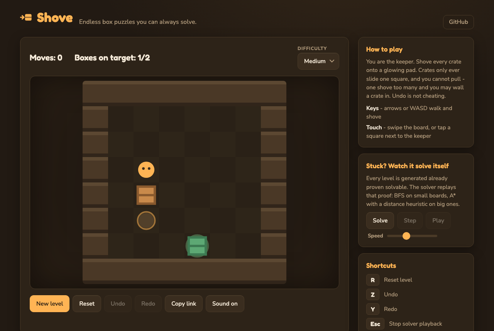

# Shove

**▶ Live demo — [apps.charliekrug.com/shove](https://apps.charliekrug.com/shove/)**

**Endless box puzzles you can always solve.**

[](https://github.com/ctkrug/sokoban-forge/actions/workflows/ci.yml)
[](LICENSE)


Shove is a browser Sokoban game for puzzle players who have finished every hand-made
level pack and want more. It generates a fresh box-pushing puzzle every time you ask,
each one guaranteed to have a solution, and when you get stuck it can find and animate
the shortest path out. No login, no build step, no backend.



## Why it exists

Two kinds of Sokoban live on the web, and both have a catch. Hand-authored level packs
are finite and run out. Random generators scatter walls and boxes and hope for the best,
so they hand you boards that often cannot be solved at all, with no way to tell before
you have wasted ten minutes on one.

Shove avoids both. It builds each level by starting from a solved board and playing legal
moves *backwards*, so every board it produces is solvable by construction, not by luck.
The same kind of search that could prove it is solvable is available to you: hit **Solve**
and watch it work.

## Features

- **A new solvable puzzle on demand.** Reverse-play generation pulls boxes off their
  targets from an already-solved board, so every level has at least one real solution.
  Press **New level** as many times as you like.
- **Three difficulties that actually differ.** Easy, Medium, and Hard scale the grid
  size, the number of boxes, and how far the board is scrambled, from a 7x7 one-box warmup
  to a 9x9 three-box tangle.
- **Watch the solver think.** Ask for a solution and Shove runs breadth-first search on
  small boards and A* with a box-to-target distance heuristic on larger ones. The status
  line tells you which algorithm ran and how many moves it found, then steps or animates
  the path move by move.
- **Undo, redo, and reset.** Back out of a mistake without restarting, or reset the whole
  board to its starting layout in one click.
- **Share the exact board.** Copy link puts the difficulty and seed in the URL, so anyone
  who opens it gets the identical puzzle. Good for sending a friend the one that stumped
  you.
- **Feels like a toy, not a tech demo.** The keeper and crates slide with a 110ms tween,
  a blocked shove nudges you back, a crate clicking onto its pad pops with a two-note
  chime, and solving a board rains confetti in the board's own palette. Every sound is
  synthesized in the browser with the Web Audio API - the game ships zero audio files -
  and the Sound button remembers your mute choice. Honors `prefers-reduced-motion`.
- **A board that fits your screen.** The canvas sizes itself to the page and renders at
  your display's pixel ratio, so tiles stay crisp from a phone to a 5K desktop.
- **Plays anywhere.** Keyboard, tap, or swipe, on desktop or phone. It is plain
  HTML/CSS/JS and a Canvas, deployable as a static site with no server.

## How to play

- **Move** with the arrow keys or WASD; on touch, swipe anywhere on the board or tap a
  tile right next to the keeper.
- **Push a box** by walking into it. It slides one tile further if that tile is clear.
- **Undo** the last move with **Z**, **Redo** with **Y**, **Reset** the board with **R**,
  or press **New level** for a fresh one at the current difficulty.
- **Solve** runs the solver from where you are now. **Step** advances the found solution
  one move, **Play** animates it (drag **Speed** to go faster), and **Escape** stops
  playback.
- **Copy link** copies a URL that reproduces the current board exactly.

## How it works

The whole idea is that generation and solving share one definition of a legal move.

1. **Generate backwards.** `generateLevel` starts from a board where every box already
   sits on a target, then applies a run of legal reverse-pull moves driven by a seeded
   RNG. Because each scramble step is the exact inverse of a forward push, replaying the
   run forward solves the board. Solvability is a property of how the level is built, not
   something checked afterward.
2. **Play forward.** Every move you make goes through one pure `move(state, direction)`
   function. An undo/redo stack wraps it, so history comes for free.
3. **Solve on demand.** The solver searches over `(player, boxes)` states using the same
   move rules the game plays by, so it can never find a "solution" the game would reject.
   BFS is optimal and simple for small boards; A* keeps the frontier small on bigger ones.

For a fuller tour see [`docs/VISION.md`](docs/VISION.md) for the design rationale and
[`docs/ARCHITECTURE.md`](docs/ARCHITECTURE.md) for a map of the modules.

## Run it locally

Shove needs Node 20 or newer to build and test. Nothing is required at runtime.

```sh
npm install
npm run dev             # local dev server with hot reload
```

## Development

```sh
npm install
npm test                # run unit tests
npm run test:coverage   # run unit tests with a coverage report
npm run lint            # lint source
npm run dev             # local dev server
npm run build           # production build to site/
```

Tests run on [Vitest](https://vitest.dev/) at 100% statement, branch, function, and line
coverage, enforced in CI so any drop fails the build. Linting is [ESLint](https://eslint.org/).

## License

MIT. See [`LICENSE`](LICENSE).

---

More of Charlie's projects → [apps.charliekrug.com](https://apps.charliekrug.com)
